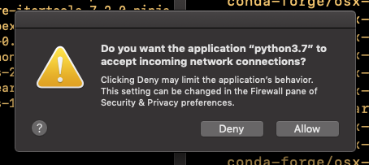
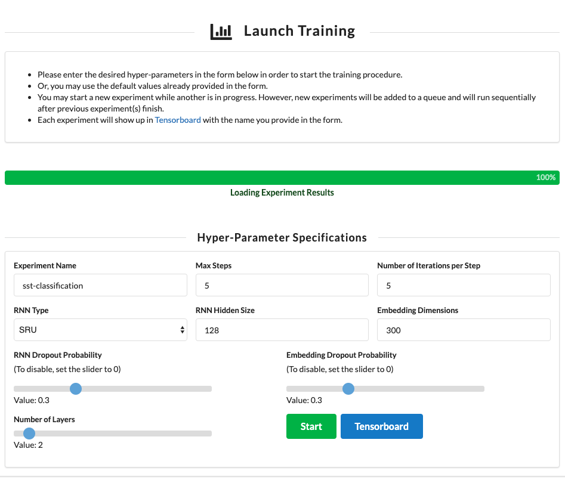
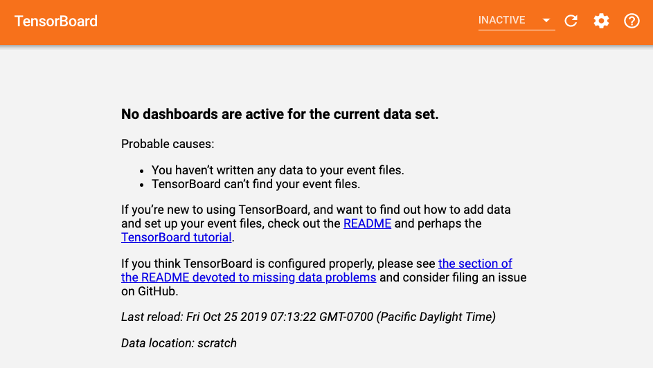

# Hyper-Parameter Tuning Dashboard

The goal of this project was to create a full-stack web application that configures, runs, and monitors a machine learning training pipeline. The model was provided by ASAPP and created with their ML framework Flambe; some starter code to create and run an experiment was also provided.

The front-end of the web application has a form where users can enter their desired hyper-parameters
of specified hyper-parameters and start the training procedure. The user has the option to utilize the default values provided in the form when the webpage loads, too.

Upon submitting the form, the desired parameters are passed to the back-end, where the form data is validated, manipulated, then utilized to run an experiment. While the experiment is running, the progress is continuously written to the progress 'database' (progress.db). The front-end has a progress bar that makes API requests via HTTP to retrieve experiment updates from the progress 'database'.

The user has the option to launch additional experiments, while another experiment is in progress. However, new experiments will be added to a queue in the order in which they were requested and will run sequentially after previous experiment(s) finish.

Note that the user may visit Tensorboard at any point when this application is running, even before their experiment is finished. If there were prior experiments, then those will be visible and labelled on the UI. Tensorboard monitors for current and prior experiments.

## Getting Started

These instructions below will get you a copy of the project up and running on your local machine. See notes further down below on how to deploy/run the project on a local host.

### Prerequisites

Please insure that you have [Anaconda3](https://www.anaconda.com/distribution/) installed, as this application uses the Conda virtual environment and Python 3.7.

### Installing

Please do the following in your terminal

Step 1. Clone the repository for the solution to the challenge project from Github.

```
git clone https://github.com/kanzakhan/asapp_challenge.git
```

Step 2. Create a new virtual environment using the environment.yml file provided in the project's root directory.

```
conda env create -f environment.yml
```

Step 3. Once everything is done installing, try running the script in the project's root directory that runs the application.

```
./run.sh
```

Step 4. At this point you should be seeing the local webserver running in your Terminal. To confirm the application is running, visit the [Experiment Homepage](http://localhost:5000/) and [Tensorboard](http://localhost:6006) in your browser.

Step 5. If you experienced issues, such as

```
"./run.sh: line 6: tensorboard: command not found"
```

or

```
ModuleNotFoundError: No module named 'absl'
```

or

```
Traceback (most recent call last):
  File "app.py", line 5, in <module>
    from flask import Flask, request, render_template, jsonify
ModuleNotFoundError: No module named 'flask'
```

then this is most likely due to packages/modules downloaded through Pip in the Conda virtual environment (when the envrioment.yml is used to install project dependencies through Conda and Pip). See the "Installation Issues" section below.

### Installation Issues

Anaconda has documented that [using Pip in Conda virtual environments](https://www.anaconda.com/using-pip-in-a-conda-environment/) can create many environment issues, and reproducing a project's state is challengeing. So the instructions below help to install dependencies one by one which avoids issues that Pip causes in Conda. NOTE: it is very important to run the Pip commands AFTER all Conda commands.


Step 0: Set up a fresh [Conda virtual environment](https://docs.conda.io/projects/conda/en/latest/user-guide/tasks/manage-environments.html#creating-an-environment-with-commands). Then [activate](https://docs.conda.io/projects/conda/en/latest/user-guide/tasks/manage-environments.html#activating-an-environment) your new virual envrioment

```
conda create --name myenv
conda activate myenv
```

Step 1: Install Flask from [Anaconda-Flask](https://anaconda.org/anaconda/flask)
```
conda install -c anaconda flask
```

Step 2: Install Tensorboard from [Anaconda-Tensorboard](https://anaconda.org/conda-forge/tensorboard)
```
conda install -c conda-forge tensorboard
```

Step 3: Install Pip from [Anaconda-Pip](https://anaconda.org/anaconda/pip)
```
conda install -c anaconda pip
```

Step 4: [Use Pip](https://docs.conda.io/projects/conda/en/latest/user-guide/tasks/manage-environments.html#using-pip-in-an-environment) to install [Flambe v. 0.4.5](https://pypi.org/project/flambe/)
```
pip install flambe==0.4.5
```

Step 5. Once everything is done installing, try running the script in the project's root directory that runs the application.

```
./run.sh
```

Step 6. At this point you should be seeing the local webserver running in your Terminal. To confirm the application is running, visit the [Experiment Homepage](http://localhost:5000/) and [Tensorboard](http://localhost:6006) in your browser.

(Step 7: If at this point, you still get error, please try to download any remaining modules or packages that may be missing based on the errors you see in terminal output.)

## Running the App

You can 'deploy' and run the project on a local Flask web server that serves up the web application using the following command in your project directory:

```
./run.sh
```

Note that once this shell script is run, you will can navigate to your [Experiment Homepage](http://localhost:5000/) and [Tensorboard](http://localhost:6006). (The links will remain inactive until the script is run.) When you do run the script, you will receive a pop-up message that asks you to accept incoming requests from the Flask web server -- like the one in this screenshot below. Be sure to accept the incoming network connection, otherwise the application will not work as it should.


The front-end user interface and Tensorboard should look the following when you successfully run the application for the first time:



## Built With

* [Flask](http://flask.palletsprojects.com/en/1.1.x/) - Lightweight Python web framework used
* [Jinja2](https://jinja.palletsprojects.com/en/2.10.x/) - HTML templating language
* [Semantic UI](https://semantic-ui.com/) - Front-end UI framework

## Versioning

For the versions available, see this project's [Github repository](https://github.com/kanzakhan/asapp_challenge).

## Authors

* **Kanza Khan** - [Kanza's Github](https://github.com/kanzakhan/)
